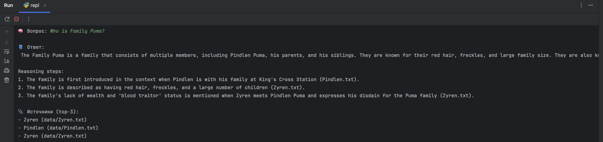
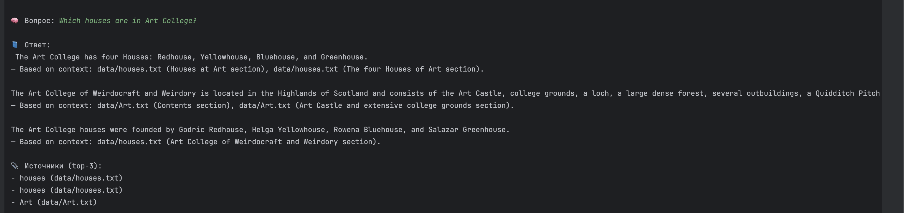
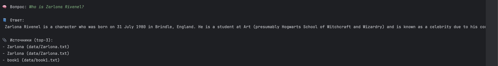
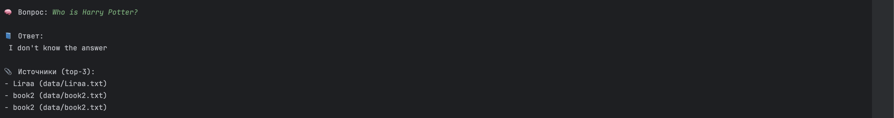
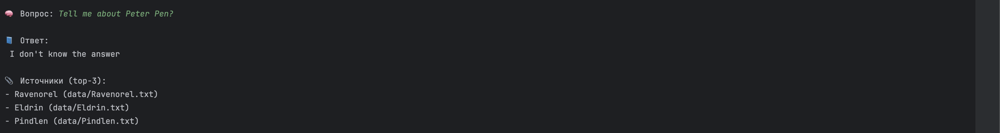

## Реализация RAG-бота с техниками промптинга

- rag bot имплементирован и находится в папке task4/src
- для запуска необходимо создать токен на HuggingFace и добавить его в файл hf_token.py
- для проверки работоспособности бота необходимо запустить repl.py (консольный бот)
- бот подгрузит предварительно созданную базу знаний из векторной БД Chroma (task3/chroma_index)
- для реализации пришлось отправлять данные на HuggingFaceAPI, тк ноутбук не потянул по мощности обрабатывать запросы локально. Более легковесная модель также не дала хороших результатов

### Примеры успешных запросов

### Примеры запросов вне базы знаний

